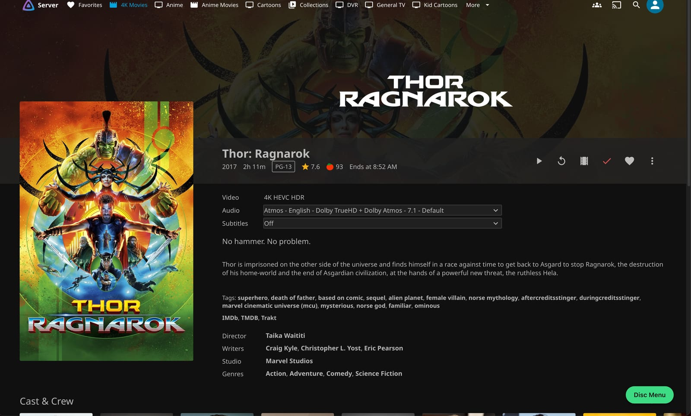
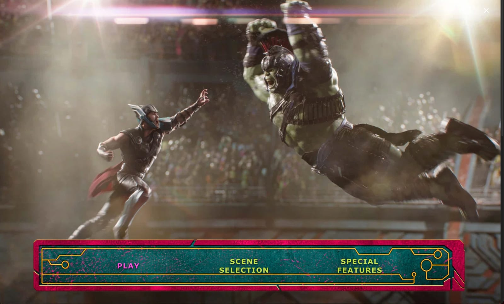
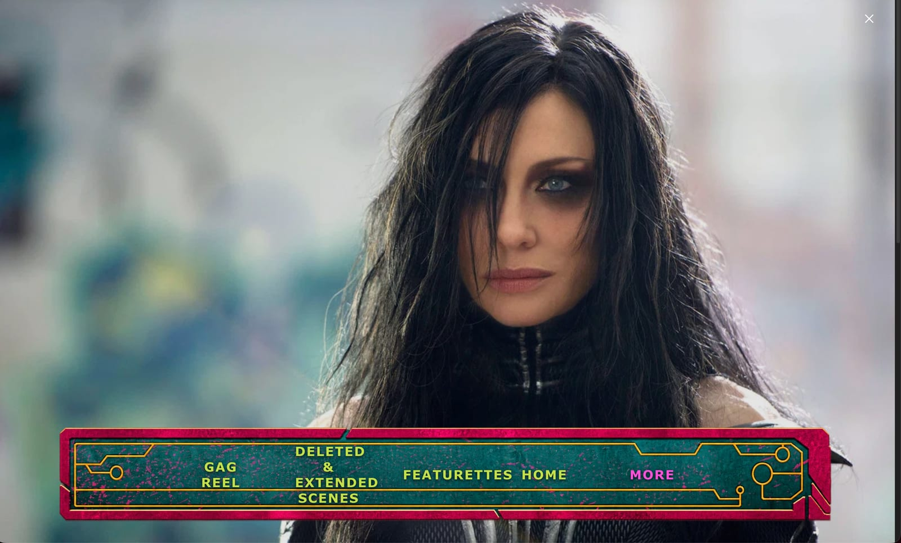
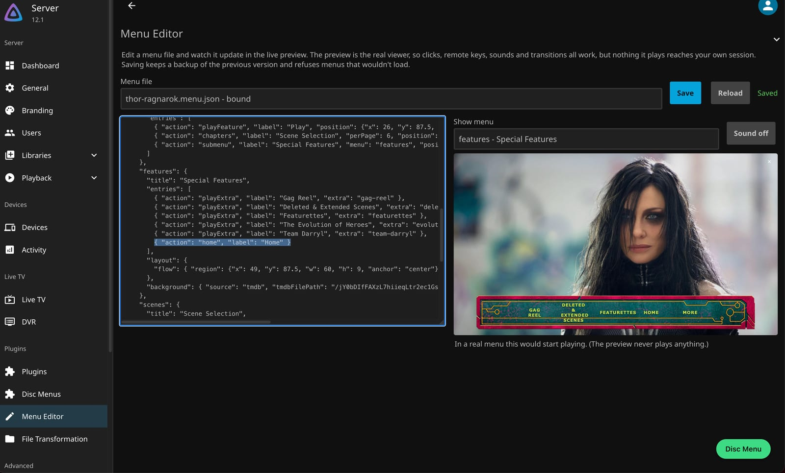

# Disc Menus for Jellyfin

A Jellyfin plugin that recreates **DVD and Blu-ray disc menus**: shareable JSON menus with backgrounds,
music, transitions and scene selection, linked automatically to the movies in your library.

> **Status: early alpha.** It works end to end on Jellyfin 12.x in the web client, but it isn't packaged for
> Jellyfin's plugin catalogue yet, so for now you build it yourself (it takes a few minutes). It's built in
> the open and **[help is very welcome](CONTRIBUTING.md)**.

> **Heads up: this project is vibe coded.** All of the code in this repository was written by an AI (Claude, through Claude Code) while
> [Phillip Berryman](https://github.com/peppy6582) steered. The one human-originated piece is the idea of describing disc menus as a
> shareable **JSON schema**, which Phillip proposed and which was then built out together. The implementation, the tests, the tooling
> and the docs are AI-generated, and no human has independently reviewed them or had them security-audited. They work (the automated
> tests pass and the author runs the plugin on their own server), but expect rough edges and **read the code before you trust it**,
> especially anything that handles untrusted menu files. Human reviewers and corrections are very welcome.

> **Where this is going:** the goal is for **client developers**, the people who build Jellyfin apps for
> phones, TVs, consoles and desktops, to implement support for this menu structure in their own apps, so
> that one menu file works everywhere. A menu is plain, portable JSON with no code, and everything a client
> needs is described by the [schema](schema/menu.schema.json) and served by the plugin's API. See
> [For client developers](#for-client-developers).

When you rip or buy a disc, you lose the menu: the "Play Movie / Scene Selection / Special Features" screen
that made it feel like a *release*. This plugin brings that back. A menu is a small JSON file that describes
the look and the structure; the plugin matches it to the right title in your library by its TMDB / IMDB id
and links its extras for you.

## Screenshots

A title with a menu gets a **Disc Menu** button on its page:

The menu, with its own background, banner, text styling and sounds, navigable by mouse, keyboard, remote or
gamepad:

Submenus sit in the same banner and page automatically: here **More** leads to the rest of the extras, and
**Home** returns to the main menu:

And the **Menu Editor** in the Jellyfin dashboard, with the JSON on the left and a live preview of the real
viewer on the right:

*These screenshots show a menu built for a real film and so contain material that isn't ours; see the
[notice](docs/screenshots/NOTICE.md). The bundled [examples](examples/README.md) use art made for this project.*

## What a menu can do

- **Look like a disc menu:** place buttons anywhere (as percentages of the screen), draw banner and panel
  layers, style the text, and use a paging grid that adds a **More** button when a submenu is too long.
- **Backgrounds:** a Jellyfin image, a TMDB backdrop, your own picture, a flat colour, or the title's own
  trailer looping behind the menu, and a different one for each page.
- **Sound and motion:** looping background music (or the title's Jellyfin theme song), button sounds, and
  fade / slide / zoom / wipe transitions between pages.
- **Scene selection** generated from the movie's chapters, with thumbnails when Jellyfin has them.
- **One-click playback** of the movie, any extra, a "Play All" sequence, or a chapter, and the menu comes
  back when playback ends. It works with a mouse, the keyboard, a TV remote and a gamepad.
- **Shareable:** a menu is layout and ids only: no file names, paths or server details, and never code, so
  menus can be exchanged safely. Your server's own links to its files are kept separately and never shared.

## Requirements

- **Jellyfin 12.x** server.
- The [**File Transformation**](https://github.com/IAmParadox27/jellyfin-plugin-file-transformation)
  plugin, which lets this plugin add its menu to the Jellyfin web client. Without it everything except the
  on-screen **Disc Menu** button still works.
- The menus are shown in the **Jellyfin web client** for now. Other clients can't render them yet (see the
  [roadmap](docs/ROADMAP.md)).

## Getting started

1. **Install:** build the plugin and copy it into your Jellyfin plugins folder, as described in the
   [development guide](docs/DEVELOPMENT.md#trying-it-on-a-jellyfin-server), then restart Jellyfin. (A proper
   release and plugin repository are on the roadmap.)
2. **Choose a folder for your menus:** the plugin uses a `menus` folder in its own data folder by default, or
   set the **Menus directory** on the plugin's page in the Jellyfin dashboard (**Disc Menus** in the sidebar).
3. **Add a menu:** copy a `.menu.json` into that folder. Try one from [`examples/`](examples/README.md), or
   change its `match` ids to a title you own. The plugin finds the title in your library and links the
   extras by type and duration. The **Menu Files** table on the dashboard page shows how it went.
4. **Watch it:** open that title in the web client and click **Disc Menu**.

To start from your own library instead, have the plugin draft a menu for a movie (a starter menu built from
its real extras and chapters, see [Authoring menus](docs/AUTHORING.md#drafting-a-menu-from-your-library)),
then refine it in the **Menu Editor** on the dashboard, which shows a live preview as you edit.

## Documentation

- **[Authoring menus](docs/AUTHORING.md):** everything a menu can contain, how discovery works, the editor.
- **[Example menus](examples/README.md):** static, solid colour, trailer, local art, and a full-featured one.
- **[Development guide](docs/DEVELOPMENT.md):** building, testing, how the code fits together.
- **[Jellyfin 12 notes](docs/JELLYFIN_NOTES.md):** verified facts about writing a plugin for Jellyfin 12.
- **[Roadmap](docs/ROADMAP.md):** what's done and what's open.

## For client developers

The long-term intent of this project is for **client apps to implement this menu structure natively**, so
a menu authored once appears the same in Jellyfin's web client and in the apps people actually watch on. If
you build or maintain a Jellyfin client, you're very welcome to take this on, and the format was designed
with that in mind:

- **Data, not code.** A menu is JSON described by [`schema/menu.schema.json`](schema/menu.schema.json).
  Positions are percentages of the screen, so any UI toolkit can draw them; backgrounds, audio and
  transitions are named choices rather than scripts.
- **Server-resolved.** `GET /DiscMenus/{itemId}/Menu` returns the menu for a title with the server's item
  ids already filled in (404 if the title has none), plus the title's chapters, trailers and theme songs
  where the menu uses them. Playing an extra is playing an ordinary Jellyfin item. Assets are served by
  `GET /DiscMenus/Assets/...`. Any signed-in user can call the menu endpoint.
- **A working reference.** [`Web/discmenus.js`](Jellyfin.Plugin.DiscMenus/Web/discmenus.js) is a complete
  implementation (layout, paging, navigation, scene selection, audio, transitions), and the suites in
  [`tests/js/`](tests/js) pin down the behaviour precisely, so they double as test vectors.
- **What's still missing for you:** a written client implementer's guide (response format, the paging and
  navigation rules) and conformance tests are on the [roadmap](docs/ROADMAP.md#other-clients). If you're
  interested, please **open an issue** so we can shape that guide around what a client actually needs; your
  questions will drive what gets written first.

## Contributing

Menus, bug reports, docs and code are all welcome. Start with **[CONTRIBUTING.md](CONTRIBUTING.md)**, and
see the [roadmap](docs/ROADMAP.md) for open work (look for **good first**). One firm rule: never add studio
artwork, music or video to the plugin's examples or assets, or to a shared menu (the documentation
screenshots are the one documented exception, see [the notice](docs/screenshots/NOTICE.md)).

To report a security problem, see [SECURITY.md](SECURITY.md).

## Credits and licence

Copyright (C) 2026 Phillip Berryman. Licensed under the [GNU General Public License v3.0](LICENSE)
(GPL-3.0-only), the same licence as the Jellyfin packages the plugin builds on.

- The code, schemas, validator, example menus, and the placeholder art and audio in `examples/assets/` (all
  generated for this project) are covered by that licence. The plugin, its examples and its assets contain **no studio artwork, music or
  video**: the `thor-ragnarok` example refers to artwork it doesn't ship.
- **The screenshots in [`docs/screenshots/`](docs/screenshots/NOTICE.md) are an exception and are not covered
  by the licence.** They show a menu built for a real film, so they contain stills, a poster and a menu
  design that belong to their owners. They're there only to illustrate the plugin; if you are a rights
  holder and want them removed, please open an issue.
- Menus are shown through [Jellyfin](https://jellyfin.org). The web client integration depends on the
  [File Transformation](https://github.com/IAmParadox27/jellyfin-plugin-file-transformation) plugin by
  IAmParadox27.
- Movie and series metadata and images come from TMDB through Jellyfin. This product uses the TMDB API but
  is not endorsed or certified by TMDB.
